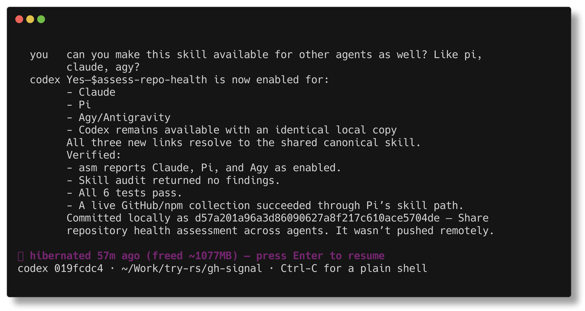

# herdr-hibernate

Idle coding-agent panes in [Herdr](https://herdr.dev) hold hundreds of MB to
several GB each — the agent process plus its MCP server children. This parks
them: it kills the process tree, leaves a few-MB bash stub in the pane, and
prints the conversation's last exchange so you can still tell what the pane was
doing. Press Enter and the exact session comes back with full history.

Panes and tabs are never closed. Only processes inside them are killed, and
only when the session can be provably resumed from disk.



That is a real parked Codex pane. The excerpt above the banner is read back
from the session transcript, because killing an agent takes its scrollback with
it — every supported agent draws on the terminal's alternate screen buffer, so
the visible conversation is gone the moment the process exits.

| Agent | Resume command | Typical RAM freed |
|---|---|---|
| Claude Code | `claude --resume <uuid>` | 650–930 MB |
| Codex CLI | `codex resume <uuid>` | ~550 MB, multi-GB after sub-agent runs |
| Grok (xAI Grok Build) | `grok --resume <uuid> --cwd <dir>` | ~35 MB plus your MCP servers |

Anything else is left alone. Killing a session with no proven way back would
lose the conversation, so the tool refuses.

## Install

Herdr ≥ 0.7.0 and Python 3. No other dependencies, no build step.

```bash
herdr plugin install testy-cool/herdr-hibernate
herdr plugin action invoke bengemine.hibernate.install   # watcher + shell hook
```

Re-run the second command after an upgrade; it refreshes the shell hook in
place. The script is self-contained, so cloning the repo and running
`./herdr-hibernate` directly works too.

**It ships in dry-run** (`DRY_RUN=1`): scans only write what they *would* do to
`~/.config/herdr-hibernate/hibernate.log`. Read a few passes, then set
`DRY_RUN=0` in `~/.config/herdr-hibernate/config` to arm it.

Tested on Linux and WSL2. macOS is untested — the watcher's systemd path does
not exist there and the nohup fallback has never been verified.

## Use it

Panes park themselves after `HIBERNATE_AFTER_MINUTES` of no transcript writes.
Everything below is for when you want to do it yourself.

```bash
./herdr-hibernate status                    # every pane, its idle time, and the verdict
./herdr-hibernate now                       # park the focused pane, skipping the idle wait
./herdr-hibernate hibernate w2:p3           # park a specific pane
./herdr-hibernate hibernate-workspace w2    # park a whole project at once
./herdr-hibernate wake-workspace w2         # bring it all back
./herdr-hibernate restore                   # re-arm panes whose stub died
```

`status` is the one to reach for when a pane refuses to park — it prints the
reason per pane:

```
PANE                   TAB LABEL                    STATUS   IDLE    CLASSIFICATION
w39:p2                 💤 1                          idle     -       EXEMPT — agent agy has no proven resume path
w20:p1                 💤 1                          -        -       hibernated (stub waiting for Enter)
w3P:p1                 1                            idle     1m      idle only 1m (< 30m threshold)
w3R:p1                 1                            working  0m      EXEMPT — status working
```

<sub>Four rows from a real run, verbatim; the full table lists every pane.</sub>

Run these from inside a Herdr pane so the CLI can reach the session.

### Keybindings

Herdr's pane menu cannot be extended by plugins, so a binding is the closest
thing to a right-click. In `~/.config/herdr/config.toml`:

```toml
[[keys.command]]
key = "prefix+shift+h"
type = "plugin_action"
command = "bengemine.hibernate.now"
description = "hibernate focused pane"

[[keys.command]]
key = "prefix+shift+z"
type = "plugin_action"
command = "bengemine.hibernate.workspace-toggle"
description = "hibernate or wake focused workspace"
```

`herdr server reload-config` applies it without a restart. `Ctrl-A` `Shift-H`
then parks whatever is focused, including a session you resumed by mistake ten
seconds ago. `Ctrl-A` `Shift-Z` toggles the whole workspace, all-or-nothing: it
refuses before killing anything if any pane is working, blocked, pinned, or
lacks a verified session.

## Never touched

- Agents that are `working` or `blocked`.
- Anything with a live background job, or Claude sub-agent workers still
  writing — a watching orchestrator looks idle but is not.
- Tabs whose label contains `📌`. This is the durable pin; `PINNED_TABS` also
  works but tab ids change across Herdr restarts.
- Panes with no session id or no transcript, agents with no resume path, and
  the pane the tool itself is running in.

## Config — `~/.config/herdr-hibernate/config`

Plain `KEY=VALUE`, re-read every scan, so edits take effect without a restart.
New keys from an upgrade are appended with their comments; your values are
never overwritten.

| Key | Default | Meaning |
|---|---|---|
| `HIBERNATE_AFTER_MINUTES` | `30` | Idle minutes before a pane qualifies. Raise above 60 if you use scheduled wake-ups. |
| `DRY_RUN` | `1` | `1` = log only. Set `0` to arm it. |
| `PIN_MARKER` | `📌` | Any tab or pane label containing this is never parked. |
| `EXCERPT_LINES` | `all` | `all` reprints the last exchange in full. A number caps each turn; `0` hides it. |
| `SCAN_INTERVAL_SECONDS` | `120` | Delay between scans in `watch` mode. |
| `KILL_GRACE_SECONDS` | `5` | Wait after SIGTERM before SIGKILL. |
| `FORGET_AFTER_MINUTES` | `15` | How long a pane must be *missing* before its record is erased. |
| `BUSY_CHILD_MINUTES` | `3` | A child started this long after its agent means a background job is running. `0` disables. |
| `BUSY_IGNORE_TOKENS` | `mcp` | Substrings that exclude a child from that check. |
| `WORKSPACE_WAKE_STAGGER_SECONDS` | `1` | Gap between resumes during a workspace wake. |
| `LOG_MAX_KB` | `512` | Log rotation size, one backup kept. |
| `PINNED_TABS` | *(empty)* | Space-separated tab ids, never parked. |

## Your data

Everything the tool owns lives in `~/.config/herdr-hibernate/` and is deleted
when the pane resumes or the tab closes — no archive, no graveyard file.

The conversations are not its data: they are the agents' own transcripts under
`~/.claude/projects/`, `~/.codex/sessions/` and `~/.grok/sessions/`, which it
only ever reads. The one copy it makes is the excerpt in each pane's stub
script. Transcripts contain whatever you pasted into them, keys included, so
those scripts are `0700` and go when their record does. `EXCERPT_LINES=0` stops
the copy being made at all.

## Known limits

- A parked pane has no agent process, so it loses its Herdr status badge until
  resumed. The `💤` tab label is the substitute.
- Reboot recovery keys on the pane id. If Herdr renumbers panes *and* changes
  tab ids at once, `restore` falls back to matching on label and cwd; a record
  it cannot place is erased after `FORGET_AFTER_MINUTES`. The session survives
  regardless — the transcript is the agent's own file.
- On WSL2 without systemd user units, `install` starts a nohup watcher that
  inherits the pane's Herdr environment, so re-run `install` after a Herdr
  restart.
- Grok panes get no excerpt yet. Its transcript schema is unverified here, and
  a wrong excerpt is worse than none.
- A pane running more than one agent process, or an agent naming a different
  session than expected, is refused rather than guessed at.

## More

[docs/how-it-works.md](docs/how-it-works.md) covers why killing an idle agent
is safe, what the guards actually check, how a parked pane survives a reboot,
and how the excerpt is built.

This is a fork of [bengemine/herdr-hibernate](https://github.com/bengemine/herdr-hibernate),
which has not been updated since 3 August 2026. It adds workspace hibernation,
Codex flag preservation, and the parked-pane excerpt. MIT licensed.
